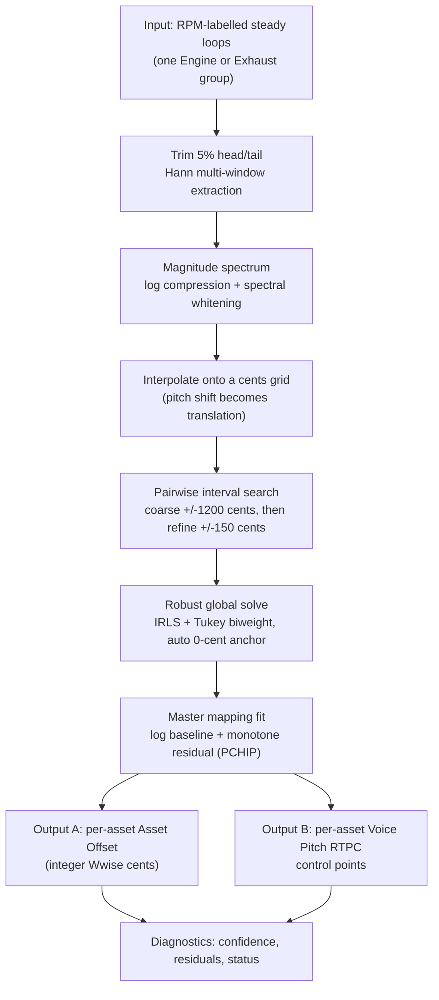

# RPM Loop Tuning Analyzer

> **English** | [简体中文](README.zh-CN.md)

A data-driven RPM → pitch mapping tool for Wwise vehicle audio: measure a set of steady engine loops with known nominal RPMs, re-learn the true RPM → acoustic-pitch relationship, and emit the **Asset Offset** and **Voice Pitch RTPC** control points needed to reproduce it in Wwise.

## Why I Built This

Engine and exhaust loops are usually tuned against a "Smart Pitch Curve" that approximates how a recorded loop's pitch actually changes with RPM. Four problems come with that workflow:

1. **The nominal RPM labels are approximate.** A file called `Engine_3000.wav` was recorded at *approximately* 3000 RPM, and the relationship between label and reality differs per recording.
2. **Loops in one set disagree with each other.** Each WAV carries its own pitch offset relative to the shared curve, and those offsets are exactly what a Wwise Asset Offset exists to correct.
3. **Hand-tuning the curve does not scale.** It also leaves no diagnostic trail: when a set sounds wrong, there is no evidence of *which* asset is off by how much.
4. **The relationship is not linear.** Pitch versus RPM is smooth and monotone, but fitting it by ear through a handful of control points is guesswork.

This tool answers the tuning question with measurement: given the whole set, solve for the relative pitch of every asset simultaneously, fit one globally monotone master curve, and output the numbers Wwise needs — plus the residuals, so a human can see how much to trust each point.

## What It Does

- **Reads a whole set** of RPM-labelled steady loops (e.g. a group of engine or exhaust recordings).
- **Builds a pitch-invariant representation** of each loop: trimmed, windowed spectra interpolated onto a logarithmic **cents grid**, so a pitch shift is a horizontal translation rather than a change of shape.
- **Measures pairwise pitch intervals** between loops with a two-stage search (coarse, then refined).
- **Solves all assets at once** for their relative acoustic pitch, using robust weighted least squares with an automatically chosen 0-cent anchor.
- **Fits a master mapping** `RPM → pitch` that is smooth and strictly monotone, with PCHIP evaluation.
- **Exports Wwise-ready numbers**: integer-cent Asset Offsets and per-asset Voice Pitch RTPC control points, as UTF-8 CSVs.
- **Explains itself**: a per-asset confidence and a diagnosis (low confidence, poor global fit, non-monotonic measurement, statistical outlier) travel with every result.

## Workflow



## Technical Highlights

- **Pitch shift becomes a translation.** Spectra are resampled onto a cents grid (`target_hz = f_min · 2^(cents/1200)`), so correlating two loops is a search over horizontal displacement rather than a comparison of differently-shaped spectra.
- **Spectral whitening, not just log compression.** A Gaussian-smoothed envelope is subtracted from the log spectrum, so correlation peaks respond to *harmonic position* rather than to differences in harmonic loudness — which would otherwise dominate the match.
- **Multi-window extraction with a median.** Each loop is measured over several windows and reduced with a per-bin median, so one noisy window cannot define the asset.
- **Two-stage interval search.** Adjacent-RPM pairs are searched across the full ±1200-cent coarse margin implied by their RPM ratio; non-adjacent pairs are refined within ±150 cents of their predicted interval. That keeps the expensive search bounded without assuming the naive mapping is already right.
- **Simultaneous solve, not pairwise chaining.** Asset differences are solved as one linear system (`A_j − A_i ≈ D_ij`) under an equality anchor constraint, so error does not accumulate along a chain of pairwise comparisons.
- **Robust by construction.** The solve uses iteratively reweighted least squares with **Tukey's biweight** (12 iterations, MAD-based scale `1.4826 · median|r|`, cutoff `4.685 · scale`, weight floor `1e-4`). A bad recording is down-weighted instead of corrupting the set.
- **Automatic anchoring.** The 0-cent reference is chosen as the eligible asset closest to the median RPM, tie-broken by higher preliminary confidence — so the anchor is a central, well-measured loop rather than an arbitrary first file.
- **Monotone by construction.** The master curve is a robust `log(RPM + K)` baseline plus a monotone non-parametric residual, evaluated with PCHIP interpolation, so pitch can never fold back on itself at any RPM.
- **Diagnostics are part of the output.** Every asset carries a confidence (pair quality blended with graph coverage) and a status such as `LOW_CONFIDENCE`, `POOR_GLOBAL_FIT`, `NON_MONOTONIC_MEASUREMENT` or `OUTLIER`. Quantisation residuals are preserved rather than discarded.

## Architecture

```text
RPM loops (WAV)
      |
      v
Spectrum / pitch-relationship measurement
      |
      v
Robust global fit (anchored IRLS)
      |
      v
Asset offsets + RTPC curve
      |
      v
Wwise (applied by hand, after review)
```

`docs/method.md` explains the measurement chain; `docs/rtpc-math.md` gives the exact formulas and the semantics of the exported numbers.

## My Role

Sole author: DSP design, the pairwise measurement stage, the robust solver, the mapping fit, export format, and the PySide6 desktop UI.

## Limitations

- **It writes files, not projects.** The tool deliberately does **not** modify a Wwise project. It produces Asset Offsets and RTPC control points that a human reviews and applies. That is a design decision, not a missing feature: these values change how a vehicle sounds.
- **It needs labelled, steady loops.** Inputs must be steady (non-sweeping) loops with a known nominal RPM. Sweeping or heavily processed material is out of scope.
- **The anchor is relative.** The system solves *relative* pitch, so the absolute pitch reference is whichever asset was chosen as the anchor. Absolute tuning remains an artistic judgement.
- **±2400 cents is a warning, not a clamp.** Values outside the usable Wwise range are flagged rather than silently corrected, so an out-of-range result stays visible.
- **Label noise is not corrected.** Nominal RPM values are taken as given; the tool compensates for offsets and a shared curve, not for a mislabelled file.
- **Test coverage is unit- and end-to-end-level**, on synthetic fixtures; it is not validated against a large corpus of real recordings.

## Repository Scope

This is a portfolio showcase repository for a private project.

Included: the method and formula documentation, the measurement/solver/mapping modules in `selected-code/`, an example Asset Offset table and RTPC control-point table in `examples/`, and the desktop UI. Excluded: the full test suite, the UI implementation, and any production audio.

## Tech Stack

`Python 3.11+` · `numpy` · `scipy` (`PchipInterpolator`, `hann`, constrained optimisation) · `soundfile` · `matplotlib` · `PySide6` (Qt) · `pytest`
