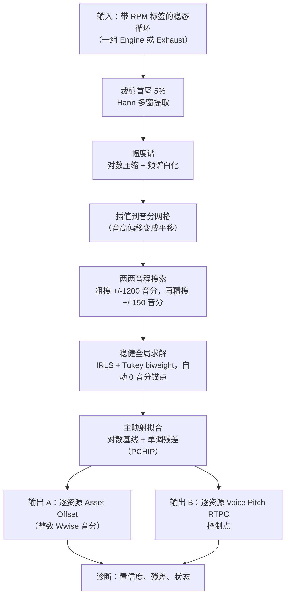

> [English](README.md) | **简体中文**

# RPM Loop Tuning Analyzer

一个面向 Wwise 载具音频的、数据驱动的 RPM → 音高映射工具：对一组已知标称 RPM 的稳态引擎循环进行测量，重新学习真实的 RPM → 声学音高关系，并输出在 Wwise 中复现该关系所需的 **Asset Offset** 与 **Voice Pitch RTPC** 控制点。

## 为什么做这个

引擎与排气管循环通常是对着一条「Smart Pitch Curve」来调的，而这条曲线只是近似描述了一段录音循环的音高实际如何随 RPM 变化。这套工作流带着四个问题：

1. **标称 RPM 标签只是近似值。** 一个叫 `Engine_3000.wav` 的文件是在*大约* 3000 RPM 录制的，而标签与真实值之间的关系每段录音都不同。
2. **同一组内的循环彼此不一致。** 每个 WAV 都带着自己相对于共享曲线的音高偏移，而这些偏移正是 Wwise Asset Offset 用来修正的东西。
3. **手工调曲线不可扩展。** 它还留不下任何诊断痕迹：当一组音频听起来不对时，你没有任何证据说明*哪个*资源偏了多少。
4. **这个关系不是线性的。** 音高对 RPM 是平滑且单调的，但靠耳朵用寥寥几个控制点去拟合它，本质上是猜。

这个工具用测量来回答调音问题：给定整组音频，同时求解每个资源的相对音高，拟合一条全局单调的主曲线，并输出 Wwise 需要的数字——外加残差，让人能看出每个点有多可信。

## 功能概览

- **读取整组**带 RPM 标签的稳态循环（例如一组引擎或排气管录音）。
- **为每个循环构建音高不变的表示：** 经裁剪、加窗的频谱被插值到对数**音分网格**上，因此音高偏移变成水平平移，而不是形状变化。
- **测量循环之间的两两音程**，采用两阶段搜索（先粗后精）。
- **一次性求解所有资源的**相对声学音高，使用稳健加权最小二乘，并自动选择 0 音分锚点。
- **拟合一条主映射** `RPM → 音高`，平滑且严格单调，使用 PCHIP 求值。
- **导出可直接用于 Wwise 的数字**：整数音分的 Asset Offset，以及逐资源的 Voice Pitch RTPC 控制点，格式为 UTF-8 CSV。
- **自带解释**：每个结果都附带逐资源的置信度与诊断（低置信度、全局拟合差、非单调测量、统计离群）。

## 工作流



## 技术要点

- **音高偏移变成平移。** 频谱被重采样到音分网格上（`target_hz = f_min · 2^(cents/1200)`），因此对两个循环做相关，是搜索水平位移，而不是比较形状不同的频谱。
- **频谱白化，而不只是对数压缩。** 从对数频谱中减去高斯平滑包络，因此相关峰响应的是*谐波位置*，而不是谐波响度差异——否则后者会主导匹配结果。
- **多窗提取并用中位数归约。** 每个循环在多个窗口上测量，再按频点取中位数归约，因此单个噪声窗口无法决定这个资源的测量结果。
- **两阶段音程搜索。** RPM 相邻的对，在其 RPM 比值所蕴含的完整 ±1200 音分粗搜范围内搜索；非相邻的对则在其预测音程的 ±150 音分内精搜。这样既把昂贵搜索限制在有限范围，又不必假设朴素映射已经正确。
- **同时求解，而不是两两串联。** 资源之间的差异被作为一个线性系统求解（`A_j − A_i ≈ D_ij`），并施加等式锚点约束，因此误差不会沿着一串两两比较累积。
- **设计上就是稳健的。** 求解使用迭代重加权最小二乘配合 **Tukey biweight**（12 次迭代，基于 MAD 的尺度 `1.4826 · median|r|`，截断值 `4.685 · scale`，权重下限 `1e-4`）。一段坏录音会被降权，而不是污染整组结果。
- **自动锚定。** 0 音分基准被选为最接近中位 RPM 的合格资源，并以较高的初步置信度作为平局裁决——因此锚点是一个居中且测量良好的循环，而不是任意挑的第一个文件。
- **设计上就是单调的。** 主曲线是稳健的 `log(RPM + K)` 基线加上单调非参数残差，用 PCHIP 插值求值，因此音高在任何 RPM 处都不可能回折。
- **诊断是输出的一部分。** 每个资源都带有置信度（由成对质量与图覆盖率混合而成）以及状态，例如 `LOW_CONFIDENCE`、`POOR_GLOBAL_FIT`、`NON_MONOTONIC_MEASUREMENT` 或 `OUTLIER`。量化残差被保留下来，而不是丢弃。

## 架构

```text
RPM loops (WAV)
      |
      v
Spectrum / pitch-relationship measurement
      |
      v
Robust global fit (anchored IRLS)
      |
      v
Asset offsets + RTPC curve
      |
      v
Wwise (applied by hand, after review)
```

`docs/method.zh-CN.md` 解释测量链路；`docs/rtpc-math.zh-CN.md` 给出精确公式与导出数字的语义。

## 我的角色

独立作者：DSP 设计、两两测量阶段、稳健求解器、映射拟合、导出格式，以及 PySide6 桌面 UI。

## 局限与边界

- **它写的是文件，不是工程。** 这个工具刻意**不**修改 Wwise 工程。它产出的 Asset Offset 与 RTPC 控制点由人复核后再应用。这是设计决策，而不是缺失的功能：这些值会改变载具听起来的样子。
- **它需要带标签的稳态循环。** 输入必须是有已知标称 RPM 的稳态（非扫频）循环。扫频或重加工过的素材不在范围内。
- **锚点是相对的。** 系统求解的是*相对*音高，因此绝对音高基准就是被选为锚点的那一个资源。绝对调音仍然属于艺术判断。
- **±2400 音分是警告，不是钳制。** 超出 Wwise 可用范围的值会被标记，而不是被静默修正，因此越界的结果始终可见。
- **标签噪声不会被修正。** 标称 RPM 值被当作已知量；这个工具补偿的是偏移与共享曲线，而不是标错的文件。
- **测试覆盖停留在单元与端到端层面**，且基于合成夹具；它没有在大量真实录音语料上验证过。

## 仓库范围

这是一个私有项目的作品集展示仓库。

包含：方法与公式文档、`selected-code/` 中的测量/求解/映射模块、`examples/` 中的示例 Asset Offset 表与 RTPC 控制点表，以及桌面 UI。不包含：完整测试套件、UI 实现，以及任何生产音频。

## 技术栈

`Python 3.11+` · `numpy` · `scipy` (`PchipInterpolator`, `hann`, constrained optimisation) · `soundfile` · `matplotlib` · `PySide6` (Qt) · `pytest`